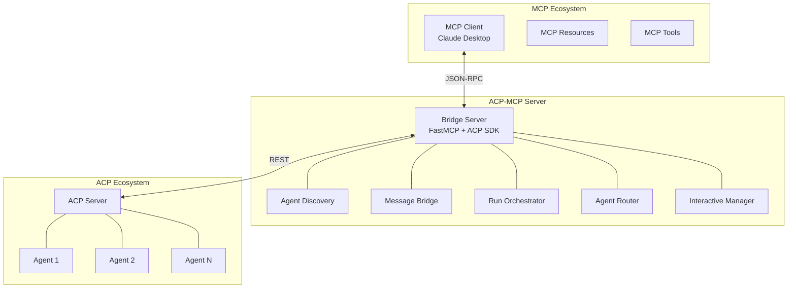

# Complete Guide: Building an ACP-MCP Server

## Table of Contents
1. [Overview](#overview)
2. [Architecture](#architecture)
3. [Prerequisites](#prerequisites)
4. [Core Components](#core-components)
5. [Implementation Guide](#implementation-guide)
6. [Deployment](#deployment)
7. [Usage Examples](#usage-examples)
8. [Advanced Features](#advanced-features)
9. [Troubleshooting](#troubleshooting)

## Overview

The ACP-MCP Server acts as a bridge between two complementary AI communication protocols:

- **ACP (Agent Communication Protocol)**: IBM's REST-based standard for agent-to-agent communication
- **MCP (Model Context Protocol)**: Anthropic's JSON-RPC standard for model-to-tool connectivity

### Why Bridge These Protocols?

**ACP Strengths:**
- Agent-to-agent communication
- Multi-modal messaging (text, images, JSON)
- Async/sync/streaming execution modes
- Complex workflow orchestration
- Interactive agent patterns (await/resume)

**MCP Strengths:**
- Model-to-tool connectivity
- Wide ecosystem support (Claude Desktop, etc.)
- Standardized tool definitions
- Resource management
- Simple integration patterns

**Combined Value:**
- Enable MCP clients to access sophisticated ACP agent networks
- Allow ACP agents to be used as MCP tools
- Create unified multi-agent + multi-tool workflows

## Architecture



### Component Responsibilities

| Component | Purpose | Input | Output |
|-----------|---------|-------|--------|
| Agent Discovery | Find and register ACP agents | ACP `/agents` endpoint | MCP resource definitions |
| Message Bridge | Convert message formats | ACP MessageParts | MCP content types |
| Run Orchestrator | Execute ACP agents | MCP tool calls | Agent run results |
| Agent Router | Route to specialized agents | Request analysis | Target agent selection |
| Interactive Manager | Handle await/resume patterns | User interactions | Resumed agent execution |

## Prerequisites

### Software Requirements
```bash
# Python 3.11+
python --version

# Required packages
pip install fastmcp acp-sdk uvicorn asyncio aiohttp pydantic
```

### ACP Server Setup
```bash
# Clone ACP repository
git clone https://github.com/i-am-bee/acp.git
cd acp

# Install ACP SDK
uv add acp-sdk

# Create a simple echo agent
cat > echo_agent.py << 'EOF'
from acp_sdk.server import Server
from acp_sdk.models import Message

server = Server()

@server.agent()
async def echo(input: list[Message]):
    """Simple echo agent for testing"""
    for message in input:
        yield message

server.run(port=8000)
EOF

# Start ACP server
python echo_agent.py
```

### Verify ACP Server
```bash
# Test agent discovery
curl http://localhost:8000/agents

# Test agent execution
curl -X POST http://localhost:8000/runs \
  -H "Content-Type: application/json" \
  -d '{"agent_name": "echo", "input": [{"parts": [{"content": "Hello ACP!"}]}]}'
```

## Core Components

### 1. Agent Discovery Tool

**Purpose**: Automatically discover ACP agents and register them as MCP resources.

```python
# agent_discovery.py
import asyncio
import aiohttp
from typing import List, Dict, Any
from fastmcp import FastMCP, Context
from pydantic import BaseModel

class ACPAgent(BaseModel):
    name: str
    description: str
    metadata: Dict[str, Any] = {}

class AgentDiscoveryTool:
    def __init__(self, acp_base_url: str = "http://localhost:8000"):
        self.acp_base_url = acp_base_url
        self.discovered_agents: Dict[str, ACPAgent] = {}
    
    async def discover_agents(self) -> List[ACPAgent]:
        """Discover all available ACP agents"""
        async with aiohttp.ClientSession() as session:
            try:
                async with session.get(f"{self.acp_base_url}/agents") as response:
                    if response.status == 200:
                        data = await response.json()
                        agents = [ACPAgent(**agent) for agent in data.get("agents", [])]
                        
                        # Update discovered agents cache
                        for agent in agents:
                            self.discovered_agents[agent.name] = agent
                        
                        return agents
                    else:
                        print(f"Failed to discover agents: {response.status}")
                        return []
            except Exception as e:
                print(f"Error discovering agents: {e}")
                return []
    
    def get_mcp_resource_uri(self, agent_name: str) -> str:
        """Generate MCP resource URI for an ACP agent"""
        return f"acp://agents/{agent_name}"
    
    async def get_agent_capabilities(self, agent_name: str) -> Dict[str, Any]:
        """Get detailed capabilities of a specific agent"""
        # This could be extended to call a capabilities endpoint
        # For now, return basic info from discovery
        agent = self.discovered_agents.get(agent_name)
        if agent:
            return {
                "name": agent.name,
                "description": agent.description,
                "metadata": agent.metadata,
                "supports_streaming": True,  # ACP supports streaming
                "supports_multimodal": True,  # ACP supports multi-modal
                "interaction_modes": ["sync", "async", "stream"]
            }
        return {}

# Integration with FastMCP
def register_discovery_tools(mcp: FastMCP, discovery: AgentDiscoveryTool):
    
    @mcp.tool()
    async def discover_acp_agents(ctx: Context) -> str:
        """Discover all available ACP agents and register them as resources"""
        agents = await discovery.discover_agents()
        
        result = {
            "discovered_count": len(agents),
            "agents": []
        }
        
        for agent in agents:
            agent_info = {
                "name": agent.name,
                "description": agent.description,
                "resource_uri": discovery.get_mcp_resource_uri(agent.name),
                "capabilities": await discovery.get_agent_capabilities(agent.name)
            }
            result["agents"].append(agent_info)
        
        await ctx.info(f"Discovered {len(agents)} ACP agents")
        return str(result)
    
    @mcp.tool()
    async def get_agent_info(agent_name: str, ctx: Context) -> str:
        """Get detailed information about a specific ACP agent"""
        capabilities = await discovery.get_agent_capabilities(agent_name)
        if capabilities:
            await ctx.info(f"Retrieved info for agent: {agent_name}")
            return str(capabilities)
        else:
            await ctx.warning(f"Agent not found: {agent_name}")
            return f"Agent '{agent_name}' not found"
```

### 2. Multi-Modal Message Bridge

**Purpose**: Convert between ACP's rich message formats and MCP content types.

```python
# message_bridge.py
from typing import List, Dict, Any, Union
from pydantic import BaseModel
from fastmcp import FastMCP, Context
import aiohttp
import base64

class ACPMessagePart(BaseModel):
    content: str
    content_type: str
    content_encoding: str = "plain"
    content_url: str = None
    name: str = None

class ACPMessage(BaseModel):
    parts: List[ACPMessagePart]

class MCPContent(BaseModel):
    type: str  # "text", "image", "resource"
    text: str = None
    data: str = None
    mimeType: str = None

class MessageBridge:
    def __init__(self):
        self.supported_content_types = {
            "text/plain": "text",
            "text/markdown": "text", 
            "image/jpeg": "image",
            "image/png": "image",
            "image/gif": "image",
            "application/json": "text"
        }
    
    async def acp_to_mcp(self, acp_messages: List[ACPMessage]) -> List[MCPContent]:
        """Convert ACP messages to MCP content format"""
        mcp_content = []
        
        for message in acp_messages:
            for part in message.parts:
                content = await self._convert_message_part(part)
                if content:
                    mcp_content.append(content)
        
        return mcp_content
    
    async def mcp_to_acp(self, text_content: str) -> List[ACPMessage]:
        """Convert MCP text to ACP message format"""
        return [ACPMessage(parts=[
            ACPMessagePart(
                content=text_content,
                content_type="text/plain",
                content_encoding="plain"
            )
        ])]
    
    async def _convert_message_part(self, part: ACPMessagePart) -> MCPContent:
        """Convert a single ACP message part to MCP content"""
        content_type = part.content_type
        
        if content_type.startswith("text/"):
            return MCPContent(
                type="text",
                text=part.content,
                mimeType=content_type
            )
        
        elif content_type.startswith("image/"):
            # Handle image content
            if part.content_url:
                # Download image from URL
                image_data = await self._download_content(part.content_url)
                if image_data:
                    return MCPContent(
                        type="image", 
                        data=base64.b64encode(image_data).decode(),
                        mimeType=content_type
                    )
            else:
                # Direct image data
                return MCPContent(
                    type="image",
                    data=part.content,
                    mimeType=content_type
                )
        
        elif content_type == "application/json":
            return MCPContent(
                type="text",
                text=part.content,
                mimeType=content_type
            )
        
        else:
            # Fallback to text representation
            return MCPContent(
                type="text", 
                text=str(part.content),
                mimeType="text/plain"
            )
    
    async def _download_content(self, url: str) -> bytes:
        """Download content from URL"""
        try:
            async with aiohttp.ClientSession() as session:
                async with session.get(url) as response:
                    if response.status == 200:
                        return await response.read()
        except Exception as e:
            print(f"Error downloading content from {url}: {e}")
        return None

# Integration with FastMCP
def register_bridge_tools(mcp: FastMCP, bridge: MessageBridge):
    
    @mcp.tool()
    async def convert_acp_message(
        acp_message_json: str, 
        ctx: Context
    ) -> str:
        """Convert ACP message format to MCP-compatible format"""
        try:
            import json
            message_data = json.loads(acp_message_json)
            acp_message = ACPMessage(**message_data)
            
            mcp_content = await bridge.acp_to_mcp([acp_message])
            
            await ctx.info(f"Converted ACP message with {len(acp_message.parts)} parts")
            return json.dumps([content.dict() for content in mcp_content], indent=2)
            
        except Exception as e:
            await ctx.error(f"Error converting message: {e}")
            return f"Error: {e}"
    
    @mcp.tool()
    async def analyze_message_content(
        acp_message_json: str,
        ctx: Context
    ) -> str:
        """Analyze the content types and structure of an ACP message"""
        try:
            import json
            message_data = json.loads(acp_message_json)
            acp_message = ACPMessage(**message_data)
            
            analysis = {
                "total_parts": len(acp_message.parts),
                "content_types": {},
                "has_urls": False,
                "encodings": set(),
                "total_size": 0
            }
            
            for part in acp_message.parts:
                content_type = part.content_type
                analysis["content_types"][content_type] = analysis["content_types"].get(content_type, 0) + 1
                analysis["encodings"].add(part.content_encoding)
                
                if part.content_url:
                    analysis["has_urls"] = True
                
                if part.content:
                    analysis["total_size"] += len(part.content)
            
            analysis["encodings"] = list(analysis["encodings"])
            
            await ctx.info(f"Analyzed message with {analysis['total_parts']} parts")
            return json.dumps(analysis, indent=2)
            
        except Exception as e:
            await ctx.error(f"Error analyzing message: {e}")
            return f"Error: {e}"
```

### 3. Run Orchestrator

**Purpose**: Execute ACP agents with different modes through MCP interface.

```python
# run_orchestrator.py
import asyncio
import aiohttp
import json
from typing import Dict, Any, List, Optional
from enum import Enum
from pydantic import BaseModel
from fastmcp import FastMCP, Context
from message_bridge import MessageBridge, ACPMessage

class RunMode(str, Enum):
    SYNC = "sync"
    ASYNC = "async"
    STREAM = "stream"

class RunStatus(str, Enum):
    CREATED = "created"
    RUNNING = "running"
    COMPLETED = "completed"
    FAILED = "failed"

class ACPRun(BaseModel):
    run_id: str
    agent_name: str
    status: RunStatus
    output: List[Dict[str, Any]] = []
    error: Optional[str] = None
    session_id: Optional[str] = None

class RunOrchestrator:
    def __init__(self, acp_base_url: str = "http://localhost:8000"):
        self.acp_base_url = acp_base_url
        self.message_bridge = MessageBridge()
        self.active_runs: Dict[str, ACPRun] = {}
    
    async def execute_agent_sync(
        self, 
        agent_name: str, 
        input_text: str,
        session_id: Optional[str] = None
    ) -> ACPRun:
        """Execute an ACP agent synchronously"""
        
        # Convert input to ACP format
        acp_messages = await self.message_bridge.mcp_to_acp(input_text)
        
        payload = {
            "agent_name": agent_name,
            "input": [msg.dict() for msg in acp_messages],
            "mode": "sync"
        }
        
        if session_id:
            payload["session_id"] = session_id
        
        async with aiohttp.ClientSession() as session:
            try:
                async with session.post(
                    f"{self.acp_base_url}/runs",
                    json=payload,
                    headers={"Content-Type": "application/json"}
                ) as response:
                    
                    if response.status == 200:
                        result = await response.json()
                        run = ACPRun(**result)
                        self.active_runs[run.run_id] = run
                        return run
                    else:
                        error_msg = f"ACP request failed: {response.status}"
                        return ACPRun(
                            run_id="error",
                            agent_name=agent_name,
                            status=RunStatus.FAILED,
                            error=error_msg
                        )
                        
            except Exception as e:
                return ACPRun(
                    run_id="error",
                    agent_name=agent_name,
                    status=RunStatus.FAILED,
                    error=str(e)
                )
    
    async def execute_agent_async(
        self,
        agent_name: str,
        input_text: str,
        session_id: Optional[str] = None
    ) -> str:
        """Start an asynchronous ACP agent execution"""
        
        acp_messages = await self.message_bridge.mcp_to_acp(input_text)
        
        payload = {
            "agent_name": agent_name,
            "input": [msg.dict() for msg in acp_messages],
            "mode": "async"
        }
        
        if session_id:
            payload["session_id"] = session_id
        
        async with aiohttp.ClientSession() as session:
            try:
                async with session.post(
                    f"{self.acp_base_url}/runs",
                    json=payload,
                    headers={"Content-Type": "application/json"}
                ) as response:
                    
                    if response.status == 200:
                        result = await response.json()
                        run_id = result.get("run_id")
                        
                        # Store partial run info
                        run = ACPRun(
                            run_id=run_id,
                            agent_name=agent_name,
                            status=RunStatus.CREATED
                        )
                        self.active_runs[run_id] = run
                        
                        return run_id
                    else:
                        raise Exception(f"Failed to start async run: {response.status}")
                        
            except Exception as e:
                raise Exception(f"Error starting async run: {e}")
    
    async def get_run_status(self, run_id: str) -> ACPRun:
        """Get the status of an async run"""
        
        async with aiohttp.ClientSession() as session:
            try:
                async with session.get(f"{self.acp_base_url}/runs/{run_id}") as response:
                    if response.status == 200:
                        result = await response.json()
                        run = ACPRun(**result)
                        self.active_runs[run_id] = run
                        return run
                    else:
                        raise Exception(f"Failed to get run status: {response.status}")
                        
            except Exception as e:
                # Return cached run or error
                if run_id in self.active_runs:
                    return self.active_runs[run_id]
                else:
                    return ACPRun(
                        run_id=run_id,
                        agent_name="unknown",
                        status=RunStatus.FAILED,
                        error=str(e)
                    )
    
    async def execute_agent_stream(
        self,
        agent_name: str,
        input_text: str,
        session_id: Optional[str] = None
    ) -> AsyncGenerator[str, None]:
        """Execute an ACP agent with streaming"""
        
        acp_messages = await self.message_bridge.mcp_to_acp(input_text)
        
        payload = {
            "agent_name": agent_name,
            "input": [msg.dict() for msg in acp_messages], 
            "mode": "stream"
        }
        
        if session_id:
            payload["session_id"] = session_id
        
        async with aiohttp.ClientSession() as session:
            try:
                async with session.post(
                    f"{self.acp_base_url}/runs",
                    json=payload,
                    headers={
                        "Content-Type": "application/json",
                        "Accept": "text/event-stream"
                    }
                ) as response:
                    
                    if response.status == 200:
                        async for line in response.content:
                            line_str = line.decode('utf-8').strip()
                            if line_str.startswith('data: '):
                                data = line_str[6:]  # Remove 'data: ' prefix
                                if data and data != '[DONE]':
                                    yield data
                    else:
                        yield f"Error: Stream failed with status {response.status}"
                        
            except Exception as e:
                yield f"Error: {e}"

# Integration with FastMCP
def register_orchestrator_tools(mcp: FastMCP, orchestrator: RunOrchestrator):
    
    @mcp.tool()
    async def run_acp_agent(
        agent_name: str,
        input_text: str,
        mode: str = "sync",
        session_id: str = None,
        ctx: Context = None
    ) -> str:
        """Execute an ACP agent with specified mode"""
        
        try:
            if mode == "sync":
                await ctx.info(f"Running agent '{agent_name}' synchronously")
                run = await orchestrator.execute_agent_sync(agent_name, input_text, session_id)
                
                if run.status == RunStatus.COMPLETED:
                    # Convert output back to readable format
                    if run.output:
                        mcp_content = await orchestrator.message_bridge.acp_to_mcp([
                            ACPMessage(parts=run.output)
                        ])
                        result = "\n".join([content.text for content in mcp_content if content.text])
                        await ctx.info(f"Agent completed successfully")
                        return result
                    else:
                        return "Agent completed with no output"
                else:
                    await ctx.error(f"Agent failed: {run.error}")
                    return f"Error: {run.error}"
            
            elif mode == "async":
                await ctx.info(f"Starting agent '{agent_name}' asynchronously")
                run_id = await orchestrator.execute_agent_async(agent_name, input_text, session_id)
                return f"Started async run with ID: {run_id}"
            
            else:
                await ctx.error(f"Unsupported mode: {mode}")
                return f"Unsupported mode: {mode}. Use 'sync' or 'async'"
                
        except Exception as e:
            await ctx.error(f"Error running agent: {e}")
            return f"Error: {e}"
    
    @mcp.tool()
    async def get_async_run_result(run_id: str, ctx: Context) -> str:
        """Get the result of an asynchronous run"""
        
        try:
            await ctx.info(f"Checking status of run: {run_id}")
            run = await orchestrator.get_run_status(run_id)
            
            result = {
                "run_id": run.run_id,
                "agent_name": run.agent_name,
                "status": run.status,
                "has_output": len(run.output) > 0,
                "error": run.error
            }
            
            if run.status == RunStatus.COMPLETED and run.output:
                # Convert output to readable format
                mcp_content = await orchestrator.message_bridge.acp_to_mcp([
                    ACPMessage(parts=run.output)
                ])
                result["output"] = "\n".join([content.text for content in mcp_content if content.text])
            
            return json.dumps(result, indent=2)
            
        except Exception as e:
            await ctx.error(f"Error getting run result: {e}")
            return f"Error: {e}"
    
    @mcp.tool()
    async def list_active_runs(ctx: Context) -> str:
        """List all active runs"""
        
        runs_info = []
        for run_id, run in orchestrator.active_runs.items():
            runs_info.append({
                "run_id": run_id,
                "agent_name": run.agent_name,
                "status": run.status,
                "has_error": run.error is not None
            })
        
        await ctx.info(f"Found {len(runs_info)} active runs")
        return json.dumps(runs_info, indent=2)
```

### 4. Agent Router

**Purpose**: Intelligently route requests to specialized ACP agents.

```python
# agent_router.py
import json
from typing import Dict, List, Optional, Any
from pydantic import BaseModel
from fastmcp import FastMCP, Context
from agent_discovery import AgentDiscoveryTool, ACPAgent
from run_orchestrator import RunOrchestrator

class RoutingRule(BaseModel):
    keywords: List[str]
    agent_name: str
    priority: int = 1
    description: str = ""

class RouterStrategy(BaseModel):
    name: str
    description: str
    rules: List[RoutingRule]

class AgentRouter:
    def __init__(
        self, 
        discovery: AgentDiscoveryTool,
        orchestrator: RunOrchestrator
    ):
        self.discovery = discovery
        self.orchestrator = orchestrator
        self.strategies: Dict[str, RouterStrategy] = {}
        self.default_strategy = self._create_default_strategy()
    
    def _create_default_strategy(self) -> RouterStrategy:
        """Create a default routing strategy based on common patterns"""
        return RouterStrategy(
            name="default",
            description="Default routing based on common keywords",
            rules=[
                RoutingRule(
                    keywords=["translate", "translation", "spanish", "french", "language"],
                    agent_name="translation",
                    priority=10,
                    description="Route translation requests"
                ),
                RoutingRule(
                    keywords=["weather", "temperature", "forecast", "climate"],
                    agent_name="weather",
                    priority=10,
                    description="Route weather requests"
                ),
                RoutingRule(
                    keywords=["calculate", "math", "compute", "sum", "multiply"],
                    agent_name="calculator",
                    priority=10,
                    description="Route calculation requests"
                ),
                RoutingRule(
                    keywords=["echo", "repeat", "test"],
                    agent_name="echo",
                    priority=5,
                    description="Route test requests to echo"
                )
            ]
        )
    
    def add_strategy(self, strategy: RouterStrategy):
        """Add a custom routing strategy"""
        self.strategies[strategy.name] = strategy
    
    async def route_request(
        self,
        input_text: str,
        strategy_name: str = "default",
        fallback_agent: str = "echo"
    ) -> str:
        """Route a request to the most appropriate agent"""
        
        # Get available agents
        available_agents = await self.discovery.discover_agents()
        available_agent_names = {agent.name for agent in available_agents}
        
        # Select strategy
        strategy = self.strategies.get(strategy_name, self.default_strategy)
        
        # Find best matching rule
        best_rule = None
        best_score = 0
        input_lower = input_text.lower()
        
        for rule in strategy.rules:
            # Check if agent is available
            if rule.agent_name not in available_agent_names:
                continue
                
            # Calculate match score
            score = 0
            for keyword in rule.keywords:
                if keyword.lower() in input_lower:
                    score += rule.priority
            
            if score > best_score:
                best_score = score
                best_rule = rule
        
        # Determine target agent
        if best_rule and best_score > 0:
            target_agent = best_rule.agent_name
            routing_reason = f"Matched rule: {best_rule.description} (score: {best_score})"
        else:
            # Fallback to first available agent or specified fallback
            if fallback_agent in available_agent_names:
                target_agent = fallback_agent
                routing_reason = f"Used fallback agent: {fallback_agent}"
            elif available_agents:
                target_agent = available_agents[0].name
                routing_reason = f"Used first available agent: {target_agent}"
            else:
                raise Exception("No agents available for routing")
        
        return target_agent, routing_reason
    
    async def execute_routed_request(
        self,
        input_text: str,
        strategy_name: str = "default",
        mode: str = "sync",
        session_id: Optional[str] = None
    ) -> Dict[str, Any]:
        """Route and execute a request"""
        
        try:
            # Route the request
            target_agent, routing_reason = await self.route_request(input_text, strategy_name)
            
            # Execute the agent
            if mode == "sync":
                run = await self.orchestrator.execute_agent_sync(
                    target_agent, 
                    input_text, 
                    session_id
                )
                
                result = {
                    "routed_to": target_agent,
                    "routing_reason": routing_reason,
                    "execution_mode": mode,
                    "status": run.status,
                    "run_id": run.run_id
                }
                
                if run.output:
                    # Convert output for display
                    from message_bridge import ACPMessage
                    mcp_content = await self.orchestrator.message_bridge.acp_to_mcp([
                        ACPMessage(parts=run.output)
                    ])
                    result["output"] = "\n".join([content.text for content in mcp_content if content.text])
                
                if run.error:
                    result["error"] = run.error
                
                return result
                
            else:
                # Async mode
                run_id = await self.orchestrator.execute_agent_async(
                    target_agent,
                    input_text,
                    session_id
                )
                
                return {
                    "routed_to": target_agent,
                    "routing_reason": routing_reason,
                    "execution_mode": mode,
                    "run_id": run_id,
                    "status": "async_started"
                }
                
        except Exception as e:
            return {
                "error": str(e),
                "routed_to": None,
                "routing_reason": "Routing failed"
            }

# Integration with FastMCP
def register_router_tools(mcp: FastMCP, router: AgentRouter):
    
    @mcp.tool()
    async def smart_route_request(
        input_text: str,
        strategy: str = "default",
        mode: str = "sync",
        session_id: str = None,
        ctx: Context = None
    ) -> str:
        """Intelligently route a request to the best ACP agent"""
        
        try:
            await ctx.info(f"Routing request using strategy: {strategy}")
            
            result = await router.execute_routed_request(
                input_text=input_text,
                strategy_name=strategy,
                mode=mode,
                session_id=session_id
            )
            
            if "error" not in result:
                await ctx.info(f"Routed to agent: {result['routed_to']}")
                await ctx.debug(f"Routing reason: {result['routing_reason']}")
            else:
                await ctx.error(f"Routing failed: {result['error']}")
            
            return json.dumps(result, indent=2)
            
        except Exception as e:
            await ctx.error(f"Error in smart routing: {e}")
            return f"Error: {e}"
    
    @mcp.tool()
    async def add_routing_rule(
        strategy_name: str,
        keywords: str,  # Comma-separated
        agent_name: str,
        priority: int = 5,
        description: str = "",
        ctx: Context = None
    ) -> str:
        """Add a new routing rule to a strategy"""
        
        try:
            keyword_list = [k.strip() for k in keywords.split(",")]
            
            new_rule = RoutingRule(
                keywords=keyword_list,
                agent_name=agent_name,
                priority=priority,
                description=description or f"Route to {agent_name}"
            )
            
            # Get or create strategy
            if strategy_name in router.strategies:
                strategy = router.strategies[strategy_name]
                strategy.rules.append(new_rule)
            else:
                strategy = RouterStrategy(
                    name=strategy_name,
                    description=f"Custom strategy: {strategy_name}",
                    rules=[new_rule]
                )
                router.strategies[strategy_name] = strategy
            
            await ctx.info(f"Added routing rule to strategy '{strategy_name}'")
            
            return f"Successfully added rule: {keyword_list} -> {agent_name}"
            
        except Exception as e:
            await ctx.error(f"Error adding routing rule: {e}")
            return f"Error: {e}"
    
    @mcp.tool()
    async def list_routing_strategies(ctx: Context) -> str:
        """List all available routing strategies and their rules"""
        
        try:
            strategies_info = {}
            
            # Include default strategy
            strategies_info["default"] = {
                "description": router.default_strategy.description,
                "rules": [
                    {
                        "keywords": rule.keywords,
                        "agent": rule.agent_name,
                        "priority": rule.priority,
                        "description": rule.description
                    }
                    for rule in router.default_strategy.rules
                ]
            }
            
            # Include custom strategies
            for name, strategy in router.strategies.items():
                strategies_info[name] = {
                    "description": strategy.description,
                    "rules": [
                        {
                            "keywords": rule.keywords,
                            "agent": rule.agent_name,
                            "priority": rule.priority,
                            "description": rule.description
                        }
                        for rule in strategy.rules
                    ]
                }
            
            await ctx.info(f"Found {len(strategies_info)} routing strategies")
            return json.dumps(strategies_info, indent=2)
            
        except Exception as e:
            await ctx.error(f"Error listing strategies: {e}")
            return f"Error: {e}"
    
    @mcp.tool()
    async def test_routing(
        input_text: str,
        strategy: str = "default",
        ctx: Context = None
    ) -> str:
        """Test routing without executing - shows which agent would be selected"""
        
        try:
            target_agent, routing_reason = await router.route_request(input_text, strategy)
            
            result = {
                "input": input_text,
                "strategy": strategy,
                "target_agent": target_agent,
                "routing_reason": routing_reason,
                "would_execute": True
            }
            
            await ctx.info(f"Test routing: '{input_text}' -> {target_agent}")
            return json.dumps(result, indent=2)
            
        except Exception as e:
            await ctx.error(f"Error testing routing: {e}")
            return f"Error: {e}"
```

### 5. Interactive Agent Manager

**Purpose**: Handle ACP's await/resume patterns for interactive agents.

```python
# interactive_manager.py
import json
import asyncio
from typing import Dict, Optional, Any
from pydantic import BaseModel
from fastmcp import FastMCP, Context
from run_orchestrator import RunOrchestrator
from enum import Enum

class InteractionState(str, Enum):
    WAITING = "waiting"
    RESUMED = "resumed"
    COMPLETED = "completed"
    TIMEOUT = "timeout"
    ERROR = "error"

class PendingInteraction(BaseModel):
    run_id: str
    agent_name: str
    session_id: Optional[str]
    await_message: str
    timestamp: float
    timeout_seconds: int = 300  # 5 minutes default

class InteractiveManager:
    def __init__(self, orchestrator: RunOrchestrator):
        self.orchestrator = orchestrator
        self.pending_interactions: Dict[str, PendingInteraction] = {}
        self.interaction_results: Dict[str, Any] = {}
    
    async def start_interactive_agent(
        self,
        agent_name: str,
        initial_input: str,
        session_id: Optional[str] = None,
        timeout_seconds: int = 300
    ) -> Dict[str, Any]:
        """Start an interactive agent that may require user input"""
        
        try:
            # Start the agent execution
            run = await self.orchestrator.execute_agent_sync(
                agent_name=agent_name,
                input_text=initial_input,
                session_id=session_id
            )
            
            # Check if agent is waiting for input
            if hasattr(run, 'await_request') and run.await_request:
                # Agent is waiting for input
                pending = PendingInteraction(
                    run_id=run.run_id,
                    agent_name=agent_name,
                    session_id=session_id,
                    await_message=run.await_request.get('message', 'Agent is waiting for input'),
                    timestamp=asyncio.get_event_loop().time(),
                    timeout_seconds=timeout_seconds
                )
                
                self.pending_interactions[run.run_id] = pending
                
                return {
                    "status": "awaiting_input",
                    "run_id": run.run_id,
                    "message": pending.await_message,
                    "timeout_seconds": timeout_seconds
                }
            
            else:
                # Agent completed normally
                output = ""
                if run.output:
                    from message_bridge import ACPMessage
                    mcp_content = await self.orchestrator.message_bridge.acp_to_mcp([
                        ACPMessage(parts=run.output)
                    ])
                    output = "\n".join([content.text for content in mcp_content if content.text])
                
                return {
                    "status": "completed",
                    "run_id": run.run_id,
                    "output": output,
                    "error": run.error
                }
                
        except Exception as e:
            return {
                "status": "error",
                "error": str(e)
            }
    
    async def resume_interactive_agent(
        self,
        run_id: str,
        user_input: str
    ) -> Dict[str, Any]:
        """Resume an agent that was waiting for user input"""
        
        if run_id not in self.pending_interactions:
            return {
                "status": "error",
                "error": f"No pending interaction found for run_id: {run_id}"
            }
        
        pending = self.pending_interactions[run_id]
        
        # Check timeout
        current_time = asyncio.get_event_loop().time()
        if current_time - pending.timestamp > pending.timeout_seconds:
            del self.pending_interactions[run_id]
            return {
                "status": "timeout",
                "error": "Interaction timed out"
            }
        
        try:
            # Resume the agent with user input
            # Note: This is a simplified version - actual ACP resume implementation may vary
            resume_payload = {
                "run_id": run_id,
                "resume_input": user_input
            }
            
            # For now, we'll simulate resume by starting a new session
            # In a real implementation, this would use ACP's resume endpoint
            run = await self.orchestrator.execute_agent_sync(
                agent_name=pending.agent_name,
                input_text=user_input,
                session_id=pending.session_id
            )
            
            # Clean up pending interaction
            del self.pending_interactions[run_id]
            
            # Check if agent needs more input
            if hasattr(run, 'await_request') and run.await_request:
                # Agent needs more input
                new_pending = PendingInteraction(
                    run_id=run.run_id,
                    agent_name=pending.agent_name,
                    session_id=pending.session_id,
                    await_message=run.await_request.get('message', 'Agent is waiting for more input'),
                    timestamp=current_time,
                    timeout_seconds=pending.timeout_seconds
                )
                
                self.pending_interactions[run.run_id] = new_pending
                
                return {
                    "status": "awaiting_more_input",
                    "run_id": run.run_id,
                    "message": new_pending.await_message
                }
            
            else:
                # Agent completed
                output = ""
                if run.output:
                    from message_bridge import ACPMessage
                    mcp_content = await self.orchestrator.message_bridge.acp_to_mcp([
                        ACPMessage(parts=run.output)
                    ])
                    output = "\n".join([content.text for content in mcp_content if content.text])
                
                # Store final result
                self.interaction_results[run_id] = {
                    "output": output,
                    "error": run.error,
                    "completed_at": current_time
                }
                
                return {
                    "status": "completed",
                    "run_id": run.run_id,
                    "output": output,
                    "error": run.error
                }
                
        except Exception as e:
            # Clean up on error
            if run_id in self.pending_interactions:
                del self.pending_interactions[run_id]
            
            return {
                "status": "error",
                "error": str(e)
            }
    
    async def get_pending_interactions(self) -> Dict[str, Any]:
        """Get all pending interactions"""
        
        current_time = asyncio.get_event_loop().time()
        active_interactions = {}
        expired_interactions = []
        
        for run_id, pending in self.pending_interactions.items():
            if current_time - pending.timestamp > pending.timeout_seconds:
                expired_interactions.append(run_id)
            else:
                active_interactions[run_id] = {
                    "agent_name": pending.agent_name,
                    "message": pending.await_message,
                    "waiting_seconds": int(current_time - pending.timestamp),
                    "timeout_in_seconds": int(pending.timeout_seconds - (current_time - pending.timestamp))
                }
        
        # Clean up expired interactions
        for run_id in expired_interactions:
            del self.pending_interactions[run_id]
        
        return {
            "active_count": len(active_interactions),
            "expired_count": len(expired_interactions),
            "interactions": active_interactions
        }
    
    async def cancel_interaction(self, run_id: str) -> bool:
        """Cancel a pending interaction"""
        
        if run_id in self.pending_interactions:
            del self.pending_interactions[run_id]
            return True
        return False

# Integration with FastMCP
def register_interactive_tools(mcp: FastMCP, manager: InteractiveManager):
    
    @mcp.tool()
    async def start_interactive_agent(
        agent_name: str,
        initial_input: str,
        session_id: str = None,
        timeout_minutes: int = 5,
        ctx: Context = None
    ) -> str:
        """Start an interactive ACP agent that may require user input"""
        
        try:
            await ctx.info(f"Starting interactive agent: {agent_name}")
            
            result = await manager.start_interactive_agent(
                agent_name=agent_name,
                initial_input=initial_input,
                session_id=session_id,
                timeout_seconds=timeout_minutes * 60
            )
            
            if result["status"] == "awaiting_input":
                await ctx.info(f"Agent is waiting for input: {result['message']}")
            elif result["status"] == "completed":
                await ctx.info("Agent completed without requiring input")
            else:
                await ctx.error(f"Agent failed: {result.get('error', 'Unknown error')}")
            
            return json.dumps(result, indent=2)
            
        except Exception as e:
            await ctx.error(f"Error starting interactive agent: {e}")
            return f"Error: {e}"
    
    @mcp.tool()
    async def provide_user_input(
        run_id: str,
        user_input: str,
        ctx: Context = None
    ) -> str:
        """Provide user input to resume a waiting interactive agent"""
        
        try:
            await ctx.info(f"Providing input to run: {run_id}")
            
            result = await manager.resume_interactive_agent(run_id, user_input)
            
            if result["status"] == "completed":
                await ctx.info("Interactive agent completed successfully")
            elif result["status"] == "awaiting_more_input":
                await ctx.info("Agent is waiting for additional input")
            else:
                await ctx.error(f"Resume failed: {result.get('error', 'Unknown error')}")
            
            return json.dumps(result, indent=2)
            
        except Exception as e:
            await ctx.error(f"Error providing user input: {e}")
            return f"Error: {e}"
    
    @mcp.tool()
    async def list_pending_interactions(ctx: Context) -> str:
        """List all pending interactive agents waiting for input"""
        
        try:
            interactions = await manager.get_pending_interactions()
            
            await ctx.info(f"Found {interactions['active_count']} pending interactions")
            if interactions['expired_count'] > 0:
                await ctx.warning(f"Cleaned up {interactions['expired_count']} expired interactions")
            
            return json.dumps(interactions, indent=2)
            
        except Exception as e:
            await ctx.error(f"Error listing interactions: {e}")
            return f"Error: {e}"
    
    @mcp.tool()
    async def cancel_interaction(
        run_id: str,
        ctx: Context = None
    ) -> str:
        """Cancel a pending interactive agent"""
        
        try:
            success = await manager.cancel_interaction(run_id)
            
            if success:
                await ctx.info(f"Cancelled interaction: {run_id}")
                return f"Successfully cancelled interaction: {run_id}"
            else:
                await ctx.warning(f"No pending interaction found: {run_id}")
                return f"No pending interaction found with ID: {run_id}"
                
        except Exception as e:
            await ctx.error(f"Error cancelling interaction: {e}")
            return f"Error: {e}"
```

## Main Server Implementation

```python
# acp_mcp_server.py
import asyncio
from fastmcp import FastMCP

# Import all components
from agent_discovery import AgentDiscoveryTool, register_discovery_tools
from message_bridge import MessageBridge, register_bridge_tools
from run_orchestrator import RunOrchestrator, register_orchestrator_tools
from agent_router import AgentRouter, register_router_tools
from interactive_manager import InteractiveManager, register_interactive_tools

class ACPMCPServer:
    def __init__(self, acp_base_url: str = "http://localhost:8000"):
        # Initialize FastMCP server
        self.mcp = FastMCP("ACP-MCP Bridge Server")
        
        # Initialize all components
        self.discovery = AgentDiscoveryTool(acp_base_url)
        self.message_bridge = MessageBridge()
        self.orchestrator = RunOrchestrator(acp_base_url)
        self.router = AgentRouter(self.discovery, self.orchestrator)
        self.interactive_manager = InteractiveManager(self.orchestrator)
        
        # Register all tools
        self._register_all_tools()
    
    def _register_all_tools(self):
        """Register all component tools with FastMCP"""
        
        # Core server info tool
        @self.mcp.tool()
        async def get_server_info() -> str:
            """Get information about the ACP-MCP bridge server"""
            info = {
                "name": "ACP-MCP Bridge Server",
                "description": "Bridge between Agent Communication Protocol and Model Context Protocol",
                "components": [
                    "Agent Discovery Tool",
                    "Multi-Modal Message Bridge", 
                    "Run Orchestrator",
                    "Agent Router",
                    "Interactive Manager"
                ],
                "acp_endpoint": self.discovery.acp_base_url,
                "capabilities": [
                    "Agent discovery and registration",
                    "Multi-modal message conversion",
                    "Sync/async/streaming execution",
                    "Intelligent agent routing",
                    "Interactive agent sessions"
                ]
            }
            return str(info)
        
        # Register component tools
        register_discovery_tools(self.mcp, self.discovery)
        register_bridge_tools(self.mcp, self.message_bridge)
        register_orchestrator_tools(self.mcp, self.orchestrator)
        register_router_tools(self.mcp, self.router)
        register_interactive_tools(self.mcp, self.interactive_manager)
    
    def run(self, port: int = 3000):
        """Start the ACP-MCP bridge server"""
        print(f"Starting ACP-MCP Bridge Server on port {port}")
        print(f"Connecting to ACP server at: {self.discovery.acp_base_url}")
        print("\nAvailable tools:")
        print("- Agent Discovery & Registration")
        print("- Multi-Modal Message Bridge")
        print("- Run Orchestrator (sync/async/stream)")
        print("- Intelligent Agent Router") 
        print("- Interactive Agent Manager")
        print(f"\nServer running at http://localhost:{port}")
        
        self.mcp.run(port=port)

# Example usage and deployment
if __name__ == "__main__":
    # Create and start the server
    server = ACPMCPServer(acp_base_url="http://localhost:8000")
    server.run(port=3000)
```

## Deployment

### Docker Deployment

```dockerfile
# Dockerfile
FROM python:3.11-slim

WORKDIR /app

# Copy requirements
COPY requirements.txt .
RUN pip install -r requirements.txt

# Copy source code
COPY *.py ./

# Expose port
EXPOSE 3000

# Health check
HEALTHCHECK --interval=30s --timeout=10s --start-period=5s --retries=3 \
  CMD curl -f http://localhost:3000/health || exit 1

# Start server
CMD ["python", "acp_mcp_server.py"]
```

```yaml
# docker-compose.yml
version: '3.8'

services:
  acp-server:
    build: ./acp-server
    ports:
      - "8000:8000"
    environment:
      - PORT=8000
    healthcheck:
      test: ["CMD", "curl", "-f", "http://localhost:8000/agents"]
      interval: 30s
      timeout: 10s
      retries: 3

  acp-mcp-bridge:
    build: .
    ports:
      - "3000:3000"
    environment:
      - ACP_BASE_URL=http://acp-server:8000
      - PORT=3000
    depends_on:
      acp-server:
        condition: service_healthy
    healthcheck:
      test: ["CMD", "curl", "-f", "http://localhost:3000/health"]
      interval: 30s
      timeout: 10s
      retries: 3
```

### Claude Desktop Integration

```json
// claude_desktop_config.json
{
  "mcpServers": {
    "acp-bridge": {
      "command": "python",
      "args": ["/path/to/acp_mcp_server.py"],
      "env": {
        "ACP_BASE_URL": "http://localhost:8000"
      }
    }
  }
}
```

## Usage Examples

### Basic Agent Discovery

```bash
# Using curl to test MCP tools
curl -X POST http://localhost:3000/tools/call \
  -H "Content-Type: application/json" \
  -d '{
    "name": "discover_acp_agents",
    "arguments": {}
  }'
```

### Smart Routing Example

```bash
# Route a translation request
curl -X POST http://localhost:3000/tools/call \
  -H "Content-Type: application/json" \
  -d '{
    "name": "smart_route_request",
    "arguments": {
      "input_text": "Translate hello world to Spanish",
      "strategy": "default",
      "mode": "sync"
    }
  }'
```

### Interactive Agent Example

```bash
# Start interactive agent
curl -X POST http://localhost:3000/tools/call \
  -H "Content-Type: application/json" \
  -d '{
    "name": "start_interactive_agent",
    "arguments": {
      "agent_name": "config_bot",
      "initial_input": "Help me configure my system"
    }
  }'

# Provide user input
curl -X POST http://localhost:3000/tools/call \
  -H "Content-Type: application/json" \
  -d '{
    "name": "provide_user_input", 
    "arguments": {
      "run_id": "12345678-abcd-1234-abcd-123456789abc",
      "user_input": "I want to set up authentication"
    }
  }'
```

## Advanced Features

### Custom Routing Strategies

```python
# Add custom routing for domain-specific agents
custom_strategy = RouterStrategy(
    name="enterprise",
    description="Enterprise agent routing",
    rules=[
        RoutingRule(
            keywords=["security", "auth", "login", "permissions"],
            agent_name="security_agent",
            priority=15,
            description="Route security requests"
        ),
        RoutingRule(
            keywords=["report", "analytics", "dashboard", "metrics"],
            agent_name="analytics_agent", 
            priority=15,
            description="Route analytics requests"
        )
    ]
)

router.add_strategy(custom_strategy)
```

### Message Processing Pipeline

```python
# Custom message processors for specific content types
class ImageProcessor:
    async def process_image(self, image_url: str) -> str:
        # Download and analyze image
        # Return description or analysis
        pass

class JSONProcessor:
    async def process_json(self, json_data: str) -> str:
        # Parse and validate JSON
        # Return formatted or processed data
        pass
```

### Health Monitoring

```python
# Add health monitoring endpoints
@mcp.tool()
async def health_check(ctx: Context) -> str:
    """Check health of all components"""
    
    health_status = {
        "acp_connection": False,
        "discovered_agents": 0,
        "active_runs": 0,
        "pending_interactions": 0
    }
    
    try:
        # Test ACP connection
        agents = await discovery.discover_agents()
        health_status["acp_connection"] = True
        health_status["discovered_agents"] = len(agents)
        
        # Check active runs
        health_status["active_runs"] = len(orchestrator.active_runs)
        
        # Check pending interactions
        interactions = await interactive_manager.get_pending_interactions()
        health_status["pending_interactions"] = interactions["active_count"]
        
        overall_health = "healthy" if health_status["acp_connection"] else "unhealthy"
        health_status["overall"] = overall_health
        
        return json.dumps(health_status, indent=2)
        
    except Exception as e:
        health_status["error"] = str(e)
        health_status["overall"] = "error"
        return json.dumps(health_status, indent=2)
```

## Troubleshooting

### Common Issues

**1. ACP Connection Failed**
```bash
# Check if ACP server is running
curl http://localhost:8000/agents

# Check Docker logs
docker logs acp-server

# Verify network connectivity
ping localhost
```

**2. Agent Not Found**
```bash
# Refresh agent discovery
curl -X POST http://localhost:3000/tools/call \
  -H "Content-Type: application/json" \
  -d '{"name": "discover_acp_agents", "arguments": {}}'
```

**3. Message Conversion Errors**
```python
# Enable debug logging
import logging
logging.basicConfig(level=logging.DEBUG)

# Test message conversion manually
test_message = ACPMessage(parts=[
    ACPMessagePart(content="test", content_type="text/plain")
])
result = await bridge.acp_to_mcp([test_message])
```

**4. Interactive Agent Timeouts**
```bash
# Check pending interactions
curl -X POST http://localhost:3000/tools/call \
  -H "Content-Type: application/json" \
  -d '{"name": "list_pending_interactions", "arguments": {}}'

# Cancel timed out interactions
curl -X POST http://localhost:3000/tools/call \
  -H "Content-Type: application/json" \
  -d '{"name": "cancel_interaction", "arguments": {"run_id": "timeout-run-id"}}'
```

### Performance Optimization

**1. Connection Pooling**
```python
# Use connection pooling for ACP requests
connector = aiohttp.TCPConnector(limit=100, limit_per_host=30)
session = aiohttp.ClientSession(connector=connector)
```

**2. Caching**
```python
# Cache agent discovery results
from functools import lru_cache
import time

@lru_cache(maxsize=1)
async def cached_discover_agents(cache_timestamp: int):
    return await discovery.discover_agents()

# Use with 5-minute cache
current_time = int(time.time() // 300)  # 5-minute buckets
agents = await cached_discover_agents(current_time)
```

**3. Async Optimization**
```python
# Use asyncio.gather for parallel operations
agents_task = discovery.discover_agents()
health_task = check_acp_health()

agents, health = await asyncio.gather(agents_task, health_task)
```

This comprehensive guide provides everything needed to build a production-ready ACP-MCP server that bridges these two important AI communication protocols. The modular design allows for easy extension and customization based on specific use cases and requirements.